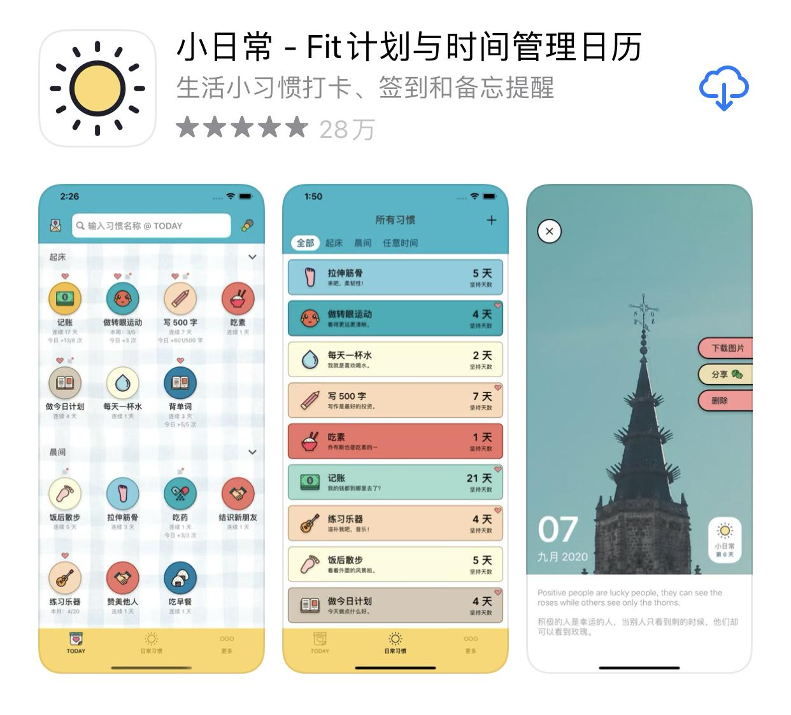

## 第6讲周末福利-好用工具推荐

### 【长截图工具 Picsew】

如果你经常截公众号文章，特别是长文的话，那么这个应用适合你。拿几个小功能举例子，你就知道只要在一个领域深钻，就会有非常多的真实痛点可以发掘。他们有个插件叫滚动截图，就是自动帮你截完一张长图。如果你是多张图片，就能自动把右侧的滚动条和顶部的状态栏去掉，甚至可以自定义截图状态栏时间是原始的截图时间，还是你此刻的生成图片时间。
手机截图，用好这一个，足够了。

### 【老照片修复神器-復得】
谁的家里没有几本老影集呢？很多时候，当我们回头看一二十年前的老照片时，都会有一种沧海桑田的感觉。想想看，这些老照片如果不数字化，可能搬几次家，就再也找不到了，几十年以后就没办法拿着老照片跟孙子们吹牛了。

推荐的这个应用，是我试了一批类似扫描应用中，效果最好的。一是可以批量一次扫多张，二是不仅仅是扫描，还有修复提亮的效果。我基本上一次扫五张，一两个小时，就把家里的影集老照片全进入了手机里，如果再搭配上谷歌相册或者华为云相册等的自动同步功能，就再也不用担心找不到老照片了。

### 【视频照片压缩大师】
我猜这个应用，应该是一个典型的理工男做出来的。因为无论从产品的名字，还是产品的设计风格，都透露出一种“你别管啥虚头巴脑的，好用就成”的直男气息。如果你经常要在微信里发视频，但是又因为视频过大发送失败，那么可以试试这个应用，能把视频体积缩小到原来的五分之一，并且在画质上损害不大。

### 【全历史】
这个产品对于很多历史爱好者并不陌生，很多时候我们在阅读时，经常不知道当年的这个地名，现在在哪里，而用全历史，经常可以看到很多历史地理之间的联系。我在看郭建龙的那本《中央帝国的军事密码》时，就是一边看书，一边对照着全历史里当年的老地图，遐想着古战场的模样。

### 【Pacer】
这是一款针对步行运动的健身应用，页面简洁，上手容易。相比 keep 这种综合性的健身 App,Pacer 显得简单和纯粹很多。不过围绕跑步和徒步的功能，并不少，其中还有虚拟挑战赛，例如有 50 公里的乞力马扎罗山奇幻之旅，就是你在现实中走 50 公里，在应用里就能看到整条线路里一个个的里程碑。

这款应用其实并不是新应用，我在几年前的苹果开发者大会上见过它的身影，但是一直不知道这个开发团队是哪里的。在 Pacer 的官网/博客等很多地方，都没标明开发者所在地，找了很久，终于发现了这款应用其实是国产健身应用“动动”的海外版。不过对比了一下国内版的动动和国外版的 Pacer，我建议你使用 Pacer，因为没广告。

### 【小日常】
你是不是经常想养成一个新习惯，但是坚持不了几天就忘记了？小日常就是一个专门记录你每天不同习惯的小工具，整个设计风格非常卡通，细节处理的很好，例如给不同的习惯设置各种个性化的提醒，并且非常清晰的告诉你，每个习惯你都坚持了多久。

有了这个工具，你所要做的就剩下了一件事情，那就是记得打开它。不过对于 iOS14 系统，已经有小组件可以方便的记录。

### 【Notion】
试用过上百种笔记类 App，现在日常使用 Notion，印象笔记用来备份。Notion上手门槛稍高，因为 可以非常自由的构建各种链接和模块，大部分人刚开始都不会太适应。不过我保证，当你坚持用上半个月，你一定会爱上这款应用。

甚至可以用这个做一个小型博客，快速搭建一个很好看的页面。上周在一个讲座上，我快速的做课堂笔记，一下课，把笔记链接直接扔到同学群里，可以复制文字可以共建页面可以一键直达重点。

### 【喝水时间】
你忙起来是不是经常忘记喝水，对于数据控来说，是不是也想知道自己每天喝多少水？那么喝水时间就是一个专注在统计喝水量的工具。

其实说“水”不足以涵盖它的全面，只要是液体，这里基本都可以找到，例如“中药”“泡腾片”“啤酒”“可尔必思”……更贴心的还有周末模式，就是 12 点之前不会提醒你喝水，免得打扰你周末好梦。

### 【如视 VR】
我一直有一个爱好，就是在不想工作的时候，打开贝壳找房，按照房价从高到低排列，挑出那种亿元别墅，用 VR 看房，想象一下自己拥有那种豪宅，从地下三层到地上三层走一遍，看完之后，感觉浑身充满了革命的力量。

而 如视 VR 就是贝壳找房的 VR 技术团队做的面向 C 端用户的产品。以前做一个 VR 必须上超级专业昂贵的设备来进行扫描，现在人人都可以自己用手机来做一个VR。现在这个产品名气还不大，不过未来如果在交互体验上再优化一下，那么很多场景都可以切入，例如让别人看看自己的房间，例如线上虚拟看展等等。

### 【iNote 灵感笔记】
如果说 Notion 胜在功能强大，那么 iNote 灵感笔记就胜在颜值高，你可以用来记录一些只言片语，然后用一些很漂亮的卡片模板分享到朋友圈里。

